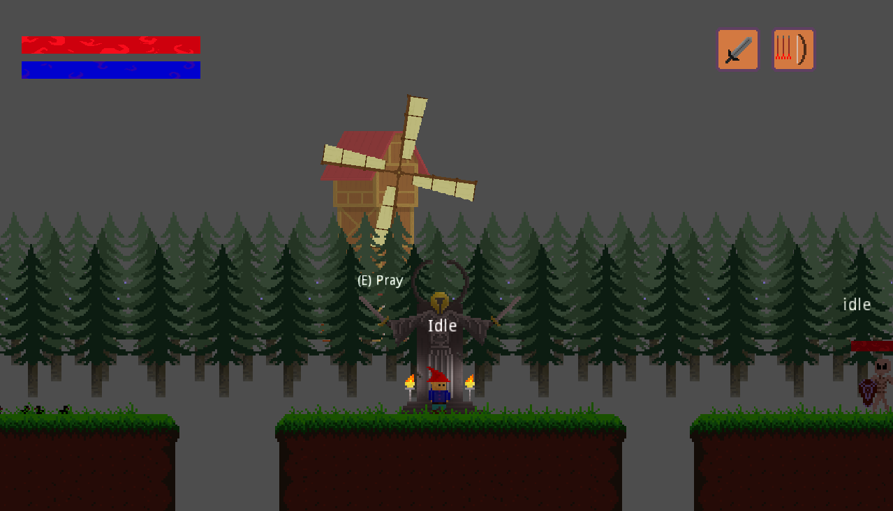
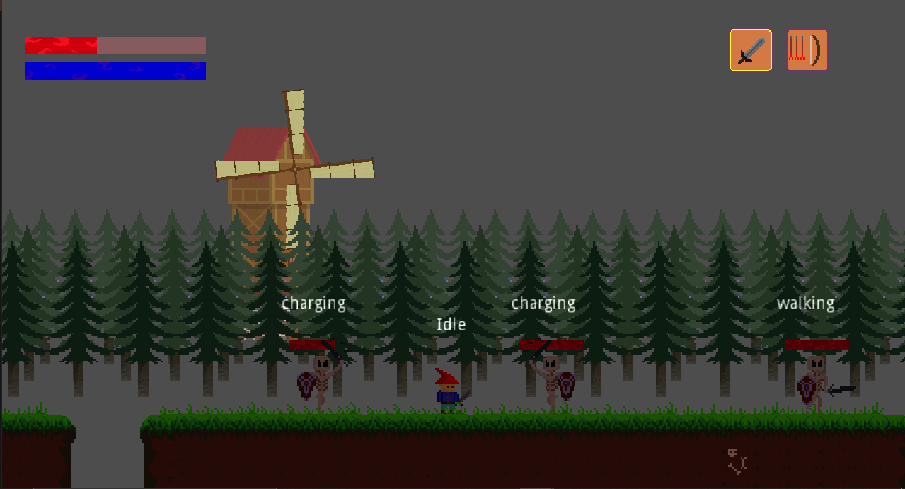
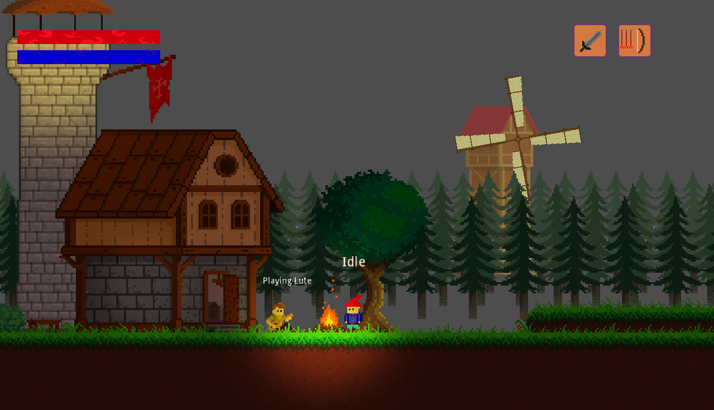

# Platformer
An old godot engine platformer i started making around 2021.
Uploading this here as an archive, im not currently developing this or intend to finish it in the future.

# About
 
>Built in godot.
>Initial plan was to make multiple levels connected as in Diablo and Baldur's Gate
>Pray to save game
>Have spells and magic system, along with the weapons system 

# 🖼️ Screenshots

